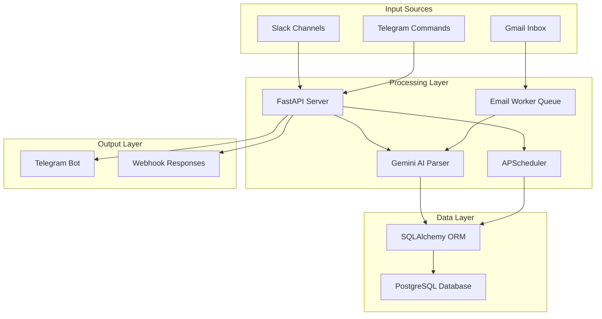
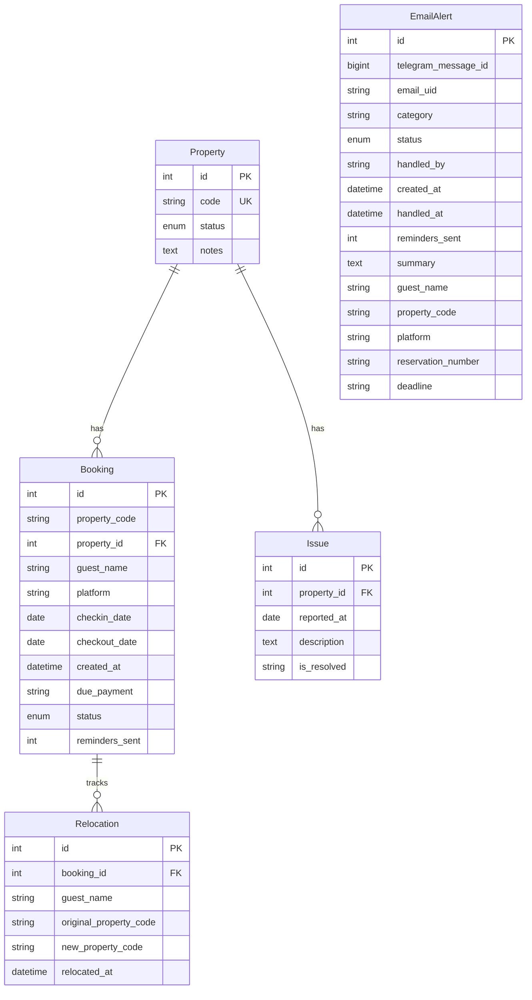

# Design Document

## Overview

The Eivissa Operations Bot is designed as a multi-platform property management system that integrates Slack, Gmail, and Telegram to provide centralized operational control. The system uses an event-driven architecture with AI-powered parsing, automated scheduling, and real-time conflict resolution capabilities.

## Architecture

### High-Level Architecture

### Component Architecture

The system follows a modular architecture with clear separation of concerns:

1. **API Layer**: FastAPI handles webhook endpoints and HTTP requests
2. **Business Logic Layer**: Handlers process domain-specific operations
3. **Data Access Layer**: SQLAlchemy ORM manages database interactions
4. **Integration Layer**: Platform-specific clients handle external APIs
5. **Scheduling Layer**: APScheduler manages automated tasks
6. **AI Processing Layer**: Gemini AI handles content parsing

## Components and Interfaces

### Core Components

#### 1. FastAPI Application (`main.py`)
- **Purpose**: Central application server and lifecycle management
- **Responsibilities**:
  - Webhook endpoint handling
  - Application startup/shutdown
  - Service initialization
  - Error handling coordination
- **Interfaces**:
  - `/telegram/webhook` - Telegram bot updates
  - `/slack/events` - Slack event subscriptions
  - `/` - Health check endpoint
  - `/debug/describe_tables` - Database introspection

#### 2. Database Models (`models.py`)
- **Purpose**: Data model definitions and constraints
- **Key Models**:
  - `Property`: Property management with status tracking
  - `Booking`: Guest booking lifecycle management
  - `Issue`: Maintenance issue tracking
  - `Relocation`: Guest relocation audit trail
  - `EmailAlert`: Email notification management
- **Design Patterns**:
  - Enum constraints for data integrity
  - Relationship mapping with cascading deletes
  - Audit timestamps for tracking

#### 3. Telegram Handlers (`telegram_handlers.py`)
- **Purpose**: Command processing and user interaction
- **Command Categories**:
  - Status queries (`/status`, `/check`, `/available`)
  - Property management (`/set_clean`, `/block_property`)
  - Booking operations (`/cancel_booking`, `/edit_booking`)
  - Conflict resolution (`/relocate`)
  - Maintenance (`/log_issue`, `/booking_history`)
- **Interactive Features**:
  - Callback query handling for buttons
  - Conflict resolution UI with swap/cancel options
  - Real-time status updates

#### 4. Slack Handler (`slack_handler.py`)
- **Purpose**: Slack message processing and data extraction
- **Processing Types**:
  - Check-in list parsing and booking creation
  - Cleaning list processing and status updates
  - Property database seeding via "great reset"
- **Features**:
  - User authorization validation
  - Fuzzy matching for typo correction
  - Conflict detection and alert generation

#### 5. Email Parser (`email_parser.py`)
- **Purpose**: Email monitoring and content extraction
- **Capabilities**:
  - IMAP email fetching with UID tracking
  - Subject-based filtering for noise reduction
  - AI-powered content parsing
  - Email marking and status management
- **Integration**: Works with async worker queue for scalability

#### 6. Scheduled Tasks (`scheduled_tasks.py`)
- **Purpose**: Automated operational tasks
- **Task Types**:
  - Daily midnight cleaning automation
  - Morning operational briefings
  - Email monitoring and processing
  - Reminder notifications
- **Features**:
  - Dynamic task scheduling
  - Error recovery and alerting
  - Background processing queues

### Integration Interfaces

#### Slack Integration
- **Webhook**: `/slack/events` endpoint
- **Authentication**: Signing secret validation
- **Event Types**: Message events from designated channels
- **Authorization**: User ID validation for list posters

#### Gmail Integration
- **Protocol**: IMAP SSL connection
- **Authentication**: Username/password with app-specific passwords
- **Processing**: Async worker queue for email parsing
- **Filtering**: Subject-based ignore patterns

#### Telegram Integration
- **Webhook**: `/telegram/webhook` endpoint
- **Features**: Command handling, callback queries, message formatting
- **Topics**: Multi-topic message routing (GENERAL, ISSUES, EMAILS)

#### AI Integration
- **Service**: Google Gemini 1.5 Flash
- **Use Cases**: 
  - Slack message parsing (check-ins, cleaning lists)
  - Email content extraction
  - Structured data generation
- **Error Handling**: Fallback parsing and validation

## Data Models

### Entity Relationship Diagram

### Data Model Design Decisions

#### 1. Status Management with Enums
- **Property Status**: `AVAILABLE`, `OCCUPIED`, `PENDING_CLEANING`, `MAINTENANCE`
- **Booking Status**: `ACTIVE`, `DEPARTED`, `CANCELLED`, `PENDING_RELOCATION`
- **Email Alert Status**: `OPEN`, `HANDLED`, `PARSING_FAILED`
- **Benefits**: Data integrity, type safety, clear state transitions

#### 2. Flexible Property-Booking Relationship
- Property code stored in booking for historical tracking
- Foreign key relationship for active queries
- Supports property renaming without data loss

#### 3. Audit Trail Design
- Relocation table tracks all guest moves
- Timestamp fields for operational tracking
- Reminder counters for escalation management

#### 4. Email Alert Structure
- Parsed data fields for operational context
- UID tracking for IMAP synchronization
- Telegram message ID for update capabilities

## Error Handling

### Error Handling Strategy

#### 1. Database Operations
- **Transaction Management**: Automatic rollback on failures
- **Connection Pooling**: Async connection management
- **Row Locking**: Concurrent access protection
- **Validation**: Enum constraints and foreign key integrity

#### 2. External API Integration
- **Retry Logic**: Exponential backoff for transient failures
- **Circuit Breaker**: Service degradation protection
- **Timeout Handling**: Prevent hanging operations
- **Fallback Responses**: Graceful degradation

#### 3. User Input Validation
- **Command Parsing**: Usage instruction on invalid syntax
- **Data Validation**: Type checking and format validation
- **Fuzzy Matching**: Typo correction suggestions
- **Error Messages**: User-friendly feedback

#### 4. System-Level Error Handling
- **Global Exception Handler**: Catch-all for unhandled exceptions
- **Logging Strategy**: Structured logging with context
- **Alert System**: Critical error notifications via Telegram
- **Health Monitoring**: System status endpoints

### Error Recovery Mechanisms

#### 1. Automatic Recovery
- **Database Reconnection**: Automatic connection retry
- **Webhook Re-registration**: Self-healing webhook setup
- **Task Rescheduling**: Failed task retry with backoff
- **Email Processing**: Queue-based retry mechanism

#### 2. Manual Recovery
- **Admin Commands**: System reset and maintenance commands
- **Debug Endpoints**: System introspection capabilities
- **Log Analysis**: Comprehensive error tracking
- **State Correction**: Manual data correction tools

## Testing Strategy

### Unit Testing
- **Model Testing**: Database model validation and constraints
- **Handler Testing**: Command processing and business logic
- **Parser Testing**: AI parsing accuracy and error handling
- **Utility Testing**: Helper function validation

### Integration Testing
- **Database Integration**: SQLAlchemy ORM functionality
- **API Integration**: External service communication
- **Webhook Testing**: End-to-end message processing
- **Scheduling Testing**: Task execution and timing

### System Testing
- **Multi-Platform Workflow**: Complete operational scenarios
- **Conflict Resolution**: Overbooking handling workflows
- **Error Scenarios**: Failure mode testing
- **Performance Testing**: Load and stress testing

### Local Development Testing
- **Docker Compose**: Local service orchestration
- **Test Database**: Isolated testing environment
- **Mock Services**: External API simulation
- **Debug Tools**: Development utilities and logging

## Deployment Architecture

### Production Environment
- **Application Server**: Render Web Service
- **Database**: Render PostgreSQL
- **Monitoring**: Application logs and health checks
- **Configuration**: Environment variable management

### Development Environment
- **Local Database**: PostgreSQL with Docker
- **Environment Variables**: `.env` file configuration
- **Development Server**: Uvicorn with hot reload
- **Testing Tools**: pytest and async testing utilities

### Security Considerations
- **API Keys**: Secure environment variable storage
- **Database Access**: Connection string encryption
- **Webhook Security**: Signature validation
- **User Authorization**: Role-based access control

## Performance Considerations

### Scalability Design
- **Async Operations**: Non-blocking I/O throughout
- **Connection Pooling**: Efficient database connections
- **Queue Processing**: Background task management
- **Caching Strategy**: Minimal state caching for performance

### Resource Optimization
- **Memory Management**: Efficient object lifecycle
- **Database Queries**: Optimized query patterns
- **API Rate Limiting**: External service throttling
- **Background Processing**: Separate worker processes

### Monitoring and Metrics
- **Application Metrics**: Performance monitoring
- **Database Metrics**: Query performance tracking
- **Error Rates**: Failure monitoring and alerting
- **User Activity**: Operational usage patterns